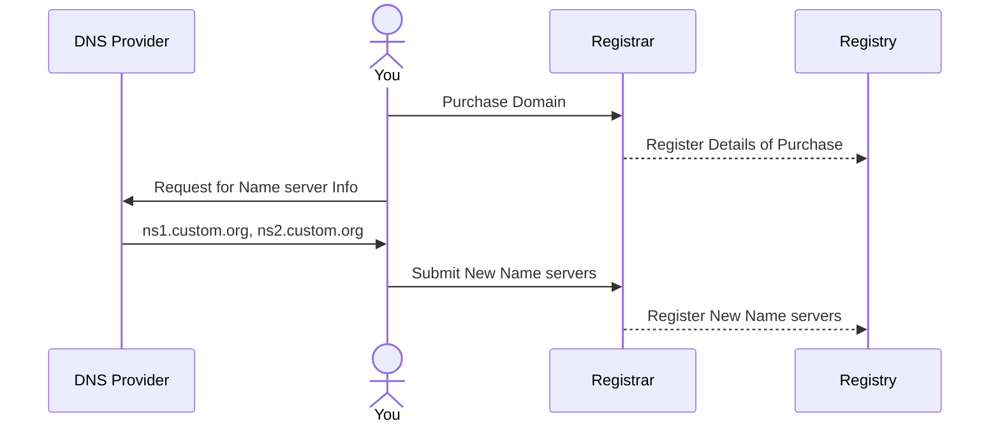
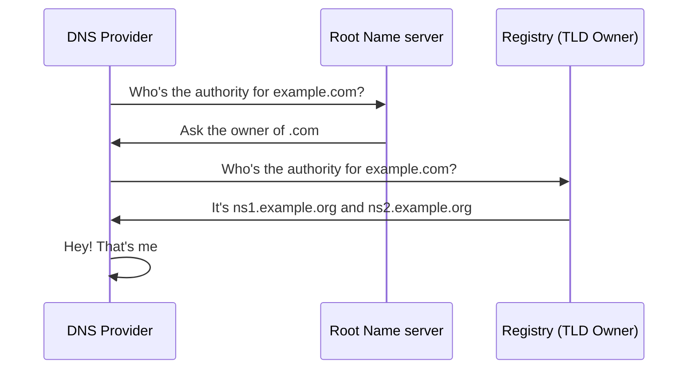
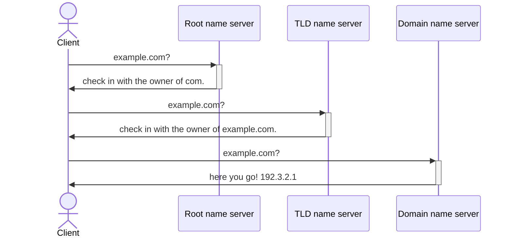

## The Flavor Text

A few days ago I 'bought' my first ever domain, `msmur.dev`!

It's a pretty major milestone for me, I've been on the fence for a *while* and between the financial commitment and the
inability to decide on a domain name – well, things were rough.

Ultimately I settled on `msmur.dev`[^1] and bit the bullet through [Namecheap](https://namecheap.com/). I was hoping the
financial commitment made sure I actually *do* something with the domain, and in that regard, it's working!

Afterward, I registered for an account on [Cloudflare](https://www.cloudflare.com/) so that I could use them as a DNS
provider, but *more importantly* use their [Cloudflare Pages](https://pages.cloudflare.com/) product which I could use
for deploying my website.

As I registered an account on Cloudflare and made them my DNS provider I realized I had no idea what these setup steps
were actually asking of me. Props to Cloudflare though they made the process easy (following some straightforward
on-screen instructions) – but given that I *do* now have my own domain to manage, I thought I'd write this to be an
overview of the things I've learned going down the rabbit hole.

There are some very well written technical articles out there, here's one
by [Cloudflare](https://www.cloudflare.com/learning/dns/what-is-dns/) and another
by [AWS](https://aws.amazon.com/route53/what-is-dns/). I'm hoping to cater to an audience that wants a bit more nuance
and depth than ChatGPT but not just a theoretical knowledge dump like those expert articles.

I'd like to answer the question of: **How does DNS make your website accessible through the internet?**

## Setting the Stage

A bit of technical vocabulary is impossible to avoid, I'd like to define the various actors and terms that
will play a role in guiding our understanding of DNS shenanigans.

_The Terms_:

- **Domains**: are a human-readable value that are used to access resources on the internet. `www.google.com` for
  example. There are various components to a domain name, here's
  the [wikipedia page](https://www.wikiwand.com/en/articles/Domain_name#Domain_name_syntax) if you're curious. I'll
  single out the `.com` (or `.net`, `.org`) component which are referred to as *Top-level* domains
- **IP Addresses**: are machine-like (well – whatever the opposite of human-readable is) identifiers for any device that
  is connected to the internet. There's **IPv4** and **IPv6**, both of which are protocols that standardize network
  communications, and the format of the addresses themselves.
- **DNS (Domain Name System)**: our star. This is the system responsible for translating domain names – into the IP
  Address of the internet-connected device that *actually* manages the resource you want to access.
- **DNS Records**: these contain various kinds of DNS related information that could be useful. There are many kinds,
  you can read through [this Cloudflare article](https://www.cloudflare.com/learning/dns/dns-records/) or just stay with
  me as I gradually introduce them to you.
- **Name server** - these are the server that store (or cache) DNS records and related information in order to answer
  DNS related queries. There are four **types**,`Recursive Resolvers`, `Root Name servers`, `TLD Name servers`, and
  `Authoritative Name servers`. The term 'Name server' is often used interchangeably with 'DNS Server'.

_The Actors_:

- **Domain Registrar** - A organization responsible for managing domain names, they are responsible for handling
  domain-related updates with the registry.
- **Domain Registry** - The organization that manages the database of domain names and their corresponding IP addresses.
- **DNS Provider** - The organization that manages the DNS infrastructure (in terms of the DNS records) for a domain.
  They own the DNS servers used in the process of resolving a domain name.

## Getting Ownership

As one might expect when they buy a `domain` – there will be no underlying server handling requests made to that
domain. Which means that there are no `IP addresses` associated with the domain[^2].

Your first course of action having purchased a domain is to settle on the `DNS provider` that will be responsible for
managing your `DNS records`. As part of their services the provider would expose `name servers` that would end up being
`authoritative`[^3] **for your domain**. That is, they'd become your `authoritative name server`.

For example, [Cloudflare DNS](https://www.cloudflare.com/application-services/products/dns/) is a DNS provider, and they
provide name servers (two of them) that you can set on your domain registry, they look something like
`ns1.cloudflare.com` and `ns2.cloudflare.com`.

By default, the `domain registrar` (where you purchased the domain e.g. Namecheap or Godaddy), also functions as a DNS
Provider. Given that this is a learning exercise though, lets assume we're going to use a different DNS provider. We
take the name server values that we get from the new DNS provider and **set** it on the domain for our dashboard (
managed on the registrar website), and voilà! We now have a different DNS provider.

Let's pause for a second, it's easy to take that last bit for granted. What does it mean to 'set' new name servers? How
exactly does "moving to a different name server" work?

When your purchase your domain, your registrar is responsible for registering the details of that transaction with the
`domain registry`. The role of a registry isn't just limited to tracking details of domain ownership, but *also* acting
as a source of truth for DNS resolution requests against top-level domains. So a domain registry tends to own the
`TLD name servers` for the top-level domains it manages.

A natural question at this point is to ask how would a DNS provider **knows** that it manages your authoritative name
servers?

They[^4] simply use the same process your own client would when trying to connect to a domain. A `Recursive Resolver` (
or `DNS Resolver`) would be responsible for querying for information on the domain.

At the end of the query resolution process the DNS provider should see the name servers it manages.

So what now?

Given this verification, your DNS provider would provide you with an interface for configuring other DNS
records for your use-case! Once configured, the name servers associated with your DNS provider would store this
information and share it when requested.

## DNS Queries

So a DNS resolver is responsible for taking a DNS query (a domain name) and resolving an IP address.

At each stage of the resolution process what information could we expect to get?

This is where `DNS Records` come in. The responding name server would have enough information to either answer the
query, or direct the resolver to another name server (down the hierarchy) to continue the resolution process.

The name server record (`NS Record`) would be the first point of contact in your query. Let's say I make a DNS query
against`example.com`. Let's assume that this is the first time such a request was made (newly minted domain!). There
would be information cached by name servers regarding this domain. Therefore, the resolver would have to start from
scratch, by getting information from the root name server.

The resolver has a list of NS records of the **root** name servers (there are 13 of them operated by various
organizations, read more [here](https://www.iana.org/domains/root/servers)). The resolver will query them, and
get a response in the form of the name servers authoritative for the top-level domain (in this case `com.`).

And so forth we go. One of those TLD name servers would return the name server authoritative for `example.com.`, and
finally we are graced with the presence of an IP address for all our hard work.

It goes something like this:
(for simplicity, we assume the client itself is a recursive resolver)

The information on the IP address is stored in a different kind of DNS record known as an `A record`.

You can use the CLI tool `dig` to visualize this entire process, just try the command `dig +trace example.com`!

Another useful tool for displaying information on DNS records is `nslookup`. You could run
`nslookup -type=<ns/a/others> example.com`.

## Verifying Ownership

Similar to how, earlier, our authoritative name server needed to verify that, it was in fact authoritative, *other* web
services may ask you to prove your ownership of a domain before allowing you to access to their services.

In my case, I wanted to use [Google Search Console](https://search.google.com/search-console) in order to see how my new
domain was being indexed and served by Google's search engine.

What happens here is that the party that wants you to verify your ownership (Google in this case), would request
you to create a TXT DNS record with a specific value in it.

You would navigate to your DNS provider dashboard, make the TXT DNS Record with the requested value, give the record a
few minutes to propagate, and then have the requester check for the existence of the record.

Under the (very reasonable) assumption that only the owner of the domain is capable of manipulating the associated DNS
records, the requester is now satisfied that you own the domain you said you do.

## Wrapping Up

There are a few more DNS related topics I found myself tangentially rabbit-holing myself into. I tried to keep this post
straightforward and only mentioned concepts that I thought was relevant to an understanding that was motivated by
simple, practical requirements.

Certain concepts were either simplified, or ignored altogether in favor of that approach. *They are* rather interesting
topics though, and I might cover them in a separate post.

[^1]: It's really just the initials of my full name
[^2]: This statement might not entirely be true. Your Domain Registrar might
often '[park](https://www.wikiwand.com/en/articles/Domain_parking)' the domain, having some DNS
records in place to point visitors to the registrar's website or an advertisement
[^3]: The term `authoritative` is used to designate the 'source of truth' for a given _part_ of a domain. The
authoritative name server would be authoritative for your entire domain (e.g. `example.com.`), The TLD name server would
be authoritative for the `com.` part of the domain, and the root name server would be authoritative for the `.` part of
the domain (which is the root from which all domains are born ;x)
[^4]: This is me making an educated guess, I wasn't able to find any official documentation on this, but it's a fairly
simple explanation that _would_ work
