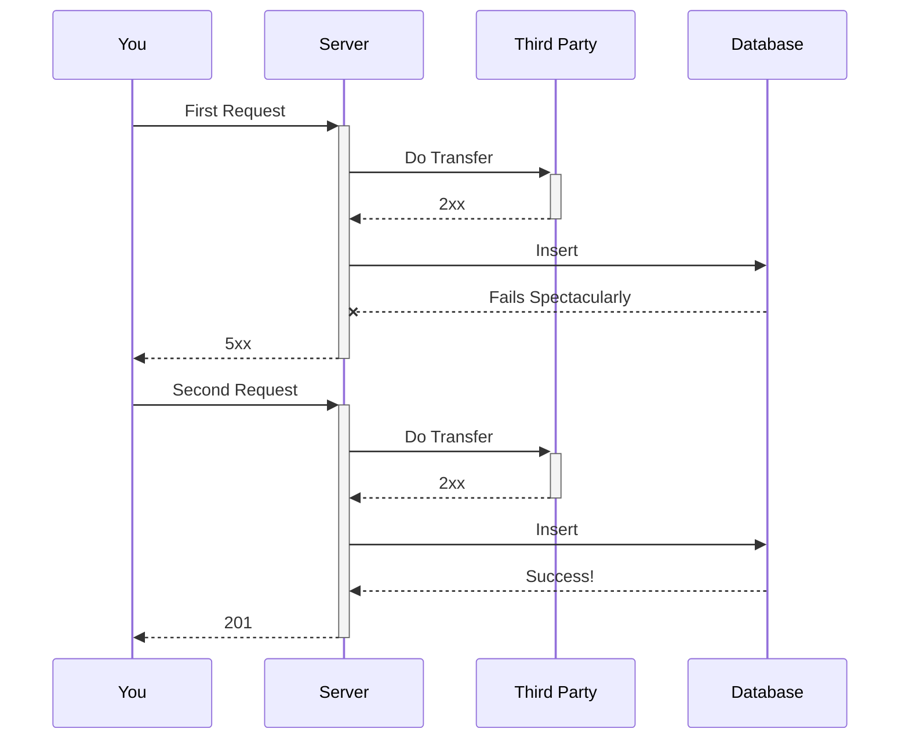

## Let's Not Get Ahead of Ourselves

Why are we discussing idempotency without understanding why we might desire it? After all, building software is a matter
of tradeoffs. We'll come to learn that building idempotent software is *pretty hard*, and the scale of refactor it
prompts would require a lot of effort, and would oftentimes be pretty difficult to justify to stakeholders given:

1. The gravy train that is your software has been chugging along just fine and a 'lack of idempotency' hasn't ruined
   you
2. Any non-trivial refactoring[^1] leads to a state of things getting worse before it gets better (well
   explained [here](https://tidyfirst.substack.com/p/the-trough-of-despair))

So yeah. *Designing and building* idempotent systems is difficult. *Refactoring* an existing system into one that is
idempotent is even more difficult, and doing all of that when your organization has adopted a (likely thinly-veiled
attempt at) Micro-service architecture, is a whole other level of difficult.

This post will cover the following:

1. The benefits of being idempotent (The Why)
2. The questions you should reflect on as you make your discussion (The Should I?)
3. Where then, given that you've consented to this masochistic journey, do we begin? (The What's Next)

## The Why

There's likely a wealth of literature on this subject, and it's not even buried underneath the mess that is Google.
Seriously, just search
up "[benefits of idempotent APIs](https://www.google.com/search?q=the+benefits+of+an+idempotent+API)"

I would like to mention the **one** I find the most interesting[^2].

**Consistency**[^3].

Software engineering is all about some compromise here, some trade-off there, in order to maximize those qualities most
fundamental to our business case. While each quality imposes its own benefits, the quality of 'consistency' as a
consequence of idempotency provides an unparalleled developer experience.

Other system quality attributes have pretty obvious benefits, but consistency provides us with one of the holy grails of
what I would consider peak software engineering. **Being able to forget a piece of software
exists**. To write software that works, and will continue working without intervention[^4].

The consistency provided by idempotency ensures that your system will never *go beyond* its intended duty. That
everything that happens can be tied to a request made to your API, and no matter how hard the world conspires against
you – you will at most **only** do what is asked of you.

This means that you do not have to worry about hanging side effects, or even the duplication of those side effects. This
is great as a builder of software given that you don't have to concern yourself with failures that might occur
independent of the software itself.

On top of that, as the user of such a system, you can rest assured that you will, at most, get what you ask for[^5]. The
guarantees between client and server here is crucial to other software qualities. Concerns of scalability, availability,
or reliability, are all now operations you can think of in terms of purely infrastructure, rather than wondering *can my
software...?*

- Can my software do its job if I horizontally scale the workload across multiple instances?
- Can my software gracefully recover if its database turns off for a few minutes?

## How

How do you make a decision here?. I think focusing on a single question would get you most of the way there.

What do we think of partially completed requests (a.k.a. the hanging side effects)?

The lack of idempotency is guaranteed to have you deal with these situations, so it makes sense to have our decision be
informed by how (or even if) we'd be able to handle this problem in the absence of idempotency.

### Are they dangerous to our business case?

Dangerous in the context of software really, *really* depends on what you're building, but to the majority of developers
building SaaS products, it's enough to think of dangerous in terms of two key aspects, "Money" and "Reputation". If the
existence of a hanging side effect costs you either of these things, then you probably don't want to risk ignoring the
fact that you aren't idempotent.

A quick example to illustrate the point.

If you provide a service that allows users to send one-time-passwords (OTPs), let's say to a mobile phone number,
having something go wrong and ending up with the end-user receiving two of OTPs isn't a serious cause for concern.

Instead, now imagine you work at a FinTech providing APIs that integrate with financial products. Let's say you allow
users to make a transfer out of your platform and into a bank account of their choice.

Having a hanging side effect here could look something like:

Note: assume both requests have the same 'idempotent identifier'.

Oh, no! The hanging side effect here is the first "Transfer" that you did but didn't record. Now you've not just failed
to record the event in your ledger, but when the user retries the action (as they should be doing, given that you
returned a`5xx`), you've now duplicated the side effect[^6]!

The lack of idempotency has cost you money (considering your user would want this action reversed), and also your
reputation (considering your software is unreliable).

### Are they difficult to reconcile?

Reconciliation in software is associated with the need to 'fix' data that is in an 'inconsistent' state due to missing
or incorrect operations.

While reconciliation protocols are pretty difficult to avoid given that systems are generally imperfect, and we need
data to be 'accurate'. They are still considered toil given that they're built on top of service logic, and often have
engineers working to do tasks manually while building out automations. These processes aren't
always trivial and will very much depend on the external system you will be reconciling against.

Using the same examples as before to illustrate this point.

For the OTP SaaS company, sure, we sent out one OTP more than we needed to – but that's fine. We could very well ignore
the duplicated OTP and move on.

At the FinTech company though. Er... we'll probably have to get reports from the banking APIs that we deal with, realize
we sent out more money than recorded in our internal ledgers, then process this data to update our ledger accordingly.

## I'm IN. What's next?

Well, amigo, let's now discuss what exactly influences our ability to be idempotent, and what we'll be talking about in
the next few posts.

We'll sort out our discussions into three buckets:

1. Operations that revolve around persisting data
2. Operations that revolve around asynchronous processes
3. Operations that revolve around triggering an external event (outside the system you control)

These are the operations that much of the SaaS world revolve around. All systems have some form of [1], utilize [2]
depending on their architecture, and is dependent on [3] if they have any other software dependency.

To what degree, in importance and relevance, these matter to you are of course, up to you to determine. But stay along
for the ride!

[^1]: "Non-trivial" is difficult to define but for our purposes let's just label any refactor that can't be done while
working on that section of that codebase (for some other feature) as non-trivial
[^2]: I do think it's also a very beneficial quality, but I do recognize that the extent of a benefit is
context-specific ultimately, up to you to decide
[^3]: It's ironic that what it means to be **Consistent** isn't all that consistent either ha, but I'm going to
hand-wave a definition here
[^4]: In reality, it's unlikely but not impossible that this is the case. You'll still have to trouble yourself over
concerns of bugs (finitely many I hope...?), maintaining dependencies, as well as infrastructure tasks, but gone are
the sleepless nights of dealing with network blips (please AWS...) or trashy partner systems that cause your software to
fail, or worse, to duplicate side effects
[^5]: It's a little more nuanced than this because, we are assuming that our users also abide by the rules by which
we're designing idempotent software. We'll talk about the things that can go wrong in a later post
[^6]: There are ways to 'avoid' this problem that don't have you relying on idempotency, but they aren't fool-proof
either and at this stage I'd prefer keeping the examples simple 
