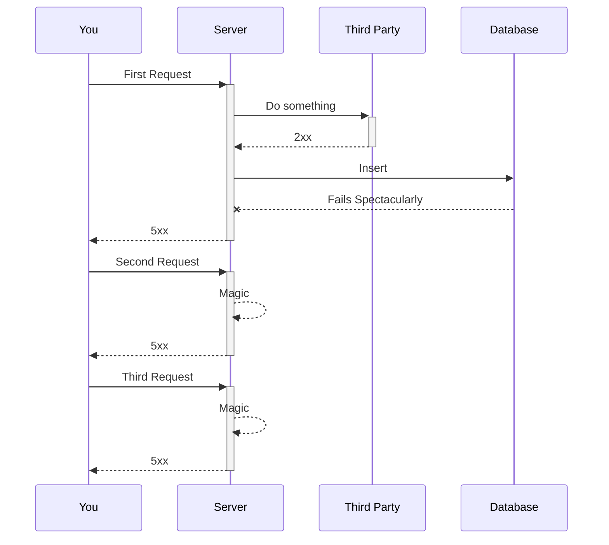

## The Introduction

I would start with a long-winded introduction of sorts but the definition isn't too complicated and I think the RFC
defines it clearly (and simply)
enough: [RFC 7231: Hypertext Transfer Protocol (HTTP/1.1): Semantics and Content](https://www.rfc-editor.org/rfc/rfc7231#section-4.2.2).

Let me note that definition here:

> A request method is considered "idempotent" if the intended effect on the server of multiple identical requests with
> that method is the same as the effect for a single such request.

I will propose my own definition down the line, but I'd like that to be a finale of sorts, an encapsulation of the ideas
explored in this series of posts. It does after all follow in lieu of the title of the series.

I will agree it is a bit of a contradiction. To refer you, the reader, to one definition as we work ourselves towards
another. Well - I'll point out it's only a contradiction if the definition down the line ends up contradicting the one
noted above. I hope it doesn't, it's meant to work with it, to augment it in some ways.

"*But **what** Maahir is there to make sense of?*" you may ask. After all, I did *also* mention that the RFC definition
was clear and simple.

That's where the issue lies. The simplicity of that definition and corresponding descriptions lulls us into a false
sense of understanding. "*Oh, that makes sense*" you say as you read up on the definition of idempotency and proceed to
never think about it again as you design your system.

## The Claim

It's because idempotency is conceptually quite straightforward, but in terms of execution nuance it's an absolute
mess. Why? Because the quality of idempotence is baked into what we as engineers consider 'business' logic, and it
scales proportionally with the complexity of that logic.

Let's prove the above claim before we continue.

Let's assume idempotence isn't baked into your business logic. Perhaps it's part of a higher level of abstraction such
as a generic middleware or library that you use.

Let's assume your REST API is called twice with the same idempotence identifier.[^1] The range of actions available to
your idempotency logic is binary. It can either:

1. Decide that it has seen this identifier previously, and return the same response as it did the last time
2. Decide that it has not seen this API called previously, and continue to process the call from scratch

This binary set of choices would be perfectly okay if everything was fine and dandy, but we wouldn't be paid so well if
our jobs were that easy.

Transient errors are a given in *any* system, and they too scale proportionally to the
`# of product managers`. What happens if, during the processing of one such API call things go south?

Typically, these errors are represented with the HTTP `500` status code in the response returned to the client.
Identical repeated requests to the API would have your server continue to return `500`s, *even if* everything is a-okay
and other requests are going through.

That... doesn't sound right.

Although some may argue that the above *is* idempotent behavior (I'm looking at
you [Stripe](https://docs.stripe.com/api/idempotent_requests)). That argument is made purely on the basis of what
is being returned to the client. In this case, repeatedly returning a `500` ignores side effects[^2] that the server may
have made as a result of the initial request. Transient errors are ubiquitous and not all side effects are as easy to
roll back as a database transaction. For example:

(Yes, there are many things going wrong here. We'll dive into those ~finer details~ problems later)

So. Which part of our code is aware of the context surrounding the side effects of our system as well as what needs to
be done to process a request without damaging repeat / dangling side effects?

## The Conclusion

Well - that would have to be the business logic itself.

Consequently, we've also been made keenly aware of what could go wrong if we _fail_ to process a request in an
idempotent matter. Repeated side effects possibly never resulting in a success state returned to the client.

This leads us to our definition:

> A request method is considered "idempotent" if the intended effect on the server of multiple identical requests brings
> the state of the server towards (but never beyond) the expected outcome of the initial request. _Without_ ever
> causing more side effects than the initial request would have caused in a happy path scenario.

[^1]: Any unique identifier (determined by the client) for that request. It's the basis on which the server can decide
if this is a duplicate request or a new one
[^2]: I'll label it a side effect in the functional sense of the term where there's some observable effect outside of
taking in an input and returning an output. Simply though, these _are_ the components of the business logic being
executed
[^3]: Okay fair enough that *could be* how it works with Stripe but then why bother with choice #**1**, just do #**2**
and process the request from scratch?
